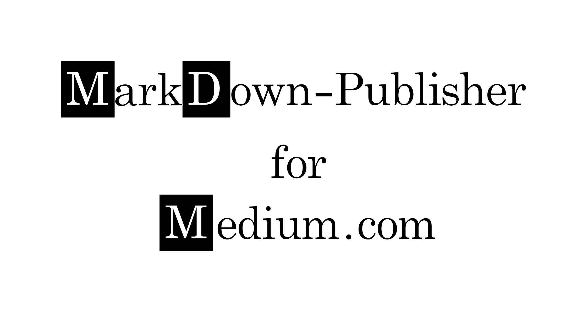

# md-publisher



<p xmlns:dct="http://purl.org/dc/terms/" xmlns:cc="http://creativecommons.org/ns#" class="license-text"><a rel="cc:attributionURL" property="dct:title" href="https://github.com/andremueller/md-publisher/blob/master/logo/md-publisher.svg">md-publisher-logo</a> by <a rel="cc:attributionURL dct:creator" property="cc:attributionName" href="www.kiwisound.de">Andre Mueller</a> is licensed under <a rel="license" href="https://creativecommons.org/licenses/by/4.0">CC BY 4.0</a></p>

The `md-publisher` golang tool shall simplify the process of publishing local HTML (and
using pandoc Markdown) files to https://medium.com.

Local images are first uploaded to medium and then the article is published as
draft.

Install the `md-publisher` tool with
```bash
go get github.com/andremueller/md-publisher
```

For using the `md-publisher` tool a integration token is required. Hereto you need an medium.com account and must have published an article. Then you can simply create a token on your settings page https://medium.com/me/settings.
Create a TOML configuration file in `$HOME/.config/md-publisher/md-publisher.conf` with the following content:

```TOML
# md-publisher.conf configuration file shall be found in
# $HOME/.config/md-publisher/md-publisher.conf

[medium]
# Settings for medium.com

# Create an integration token in your medium.com account on your settings
# page https://medium.com/me/settings and enter it here
MediumAccessToken="YOUR_ACCESS_TOKEN"
```

After that you should be able to upload a local HTML file with

```bash
md-publisher publish my_file.html
```

For further options call
```bash
./md-publisher help

NAME:
   md-publisher - Publishes an articles to medium.com

USAGE:
   md-publisher [global options] command [command options] [arguments...]

COMMANDS:
   publish  publish the given article
   help, h  Shows a list of commands or help for one command

GLOBAL OPTIONS:
   --log-level value, -L value  set logging level to (5 = debug, 4 = info, 3 = warn, 2 = error, 1 = fatal (default: 5)
   --config value, -c value     md-publisher config file (default: "/Users/muellera/.config/md-publisher/md-publisher.conf")
   --help, -h                   show help (default: false)
```

```bash
NAME:
   md-publisher publish - publish the given article

USAGE:
   md-publisher publish [command options] [arguments...]

OPTIONS:
   --no-images           Do not upload images (default: false)
```

Then you should find the newly article within your drafts including local images.

# Dependencies

| Dependency                          | License                    |
| ----------------------------------- | -------------------------- |
| github.com/urfave/cli/v2            | MIT License                |
| github.com/sirupsen/logrus          | MIT License                |
| github.com/Medium/medium-sdk-go     | Apache License Version 2.0 |
| github.com/PuerkitoBio/goquery      | BSD 3 Clause License       |
| github.com/yuin/goldmark            | MIT License                |
| github.com/litao91/goldmark-mathjax | MIT License                |


# License

MIT License

**The project is currently in an experimental state.**
So please don't blame me if something is not working. However, you are welcome to contribute to this project.

# Features

- Uploading local images in `` tags
- Setting the title to `head title`
- Settings the medium tags to `meta keywords`

For an example file see (data/demo_article.html)[data/demo_article.html]

```html
<head>
   <title>My title</title>
   <meta name="keywords" content="my tag 1, my tag 2" />
</head>
```
