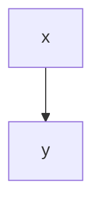

# A Demo Article
How to upload a demo article using the medium go api.


*This is a figure no. {#fig:euler}*

Refer to Figure [@fig:euler]

# Heading 1

## Heading 2

**bold font**

*emphasis*

> This is a citation block.
> And that is great!

#### Unordered List

- First item
- Second item

#### Numbered List

1. First numbered item
2. Second numbered item

### Mermaid Diagram



### Code

```bash
x="a"
for u in "${*}" ; do
   echo "Arg: $u"
done
```

### Formula

The Equation [@eq:my-equation] shows clearly ...
$$
\mu_n = \frac{1}{n}\sum_{i=1}^n x_i
$$ {#eq:my-equation}

### Tables

See [@tbl:table1] for results.

| foo | bar |
| --- | --- |
| baz | bim |

*Table: This is Table {#tbl:table1}.*

### References

See e.g. [@kestlerGeneralizedVennDiagrams2005]


