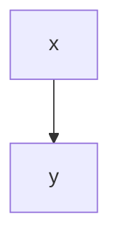

# A Demo Article
How to upload a demo article using the medium go api.


*This is a figure no. 1*


> This is a citation.
> And that is great!

# Heading 1

## Heading 2

**bold font**

*emphasis*

### Mermaid Diagram



### Code

```bash
x="a"
for u in "${*}" ; do
   echo "Arg: $u"
done
```

### Formula

$$
\mu_n = \frac{1}{n}\sum_{i=1}^n x_i
$$
