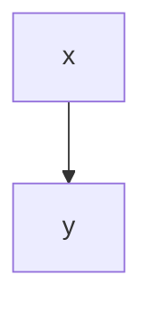

# A Demo Article
How to upload a demo article using the medium go api.

{#fig:euler}

Refer to Figure [@fig:euler]

{#fig:euler2}
# Heading 1

## Heading 2

**bold font**

*emphasis*

> This is a citation block.
> And that is great!

#### Unordered List

- First item
- Second item

#### Nested Lists

- First item
  - First subitem
  - Second subitem
- Second item
  - First subitem
  - Second subitem

#### Numbered List

1. First numbered item
2. Second numbered item

### Mermaid Diagram



### Code

```bash
x="a"
for u in "${*}" ; do
   echo "Arg: $u"
done
```

### Formula

The Equation [@eq:myEquation] shows clearly ...

Inline math
$$ \mu_n = \frac{1}{n}\sum_{i=1}^n x_i $$ {#eq:myEquation}

### Tables

See [@tbl:table1] for results.

| foo | bar |
| --- | --- |
| baz | bim |

Table: This is table caption {#tbl:table1}

### References

See e.g. [@kestlerGeneralizedVennDiagrams2005]

https://lierdakil.github.io/pandoc-crossref/
